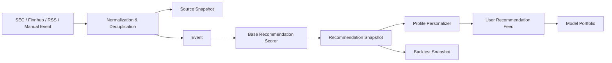

# Architecture

## Product shape

Market Reaction Forecaster ships as a FastAPI monolith with server-rendered pages, JSON APIs, background tasks, and a managed Postgres database. The first release is optimized for one thing: fast, consumer-facing large-cap tech recommendation workflows with explicit buy, hold, and sell calls.

## Core stack

| Layer | Choice | Why |
|---|---|---|
| Web app | FastAPI + Jinja2 + vanilla JS | Fast to ship, low operational complexity, easy SSR |
| Data layer | SQLAlchemy + Postgres | Strong fit for recommendation snapshots and audit history |
| Migrations | Alembic | Predictable schema management |
| Async jobs | Celery + Redis-compatible key-value | Supports polling and recompute jobs |
| Billing | Stripe Checkout + Billing Portal + webhooks | Consumer subscription flow |
| Market data | Twelve Data + Finnhub + SEC EDGAR + IR RSS | Low-cost, launch-ready data stack |
| Deploy | Docker + Render | One repo to live app path |

## Domain model

- `User`
- `UserProfile`
- `SubscriptionState`
- `Security`
- `Event`
- `SourceSnapshot`
- `RecommendationSnapshot`
- `UserRecommendation`
- `Watchlist`
- `PortfolioPosition`
- `BacktestRun`
- `ActivityEvent`
- `ConnectorState`

## Recommendation flow

## Runtime behavior

- Startup seeds the frozen launch universe.
- Demo content and backtest state are bootstrapped for a usable first-run experience.
- Quote refresh and event ingestion can be triggered through worker jobs or admin refresh actions.
- Recommendation snapshots are immutable point-in-time records.
- Personalized recommendations are regenerated from the latest snapshot set plus the current user profile.

## Security controls

- Signed session cookies
- CSRF token validation for mutating authenticated requests
- login lockouts
- trusted-host support
- basic security headers
- audit activity log

## Deployment topology

- `web`: FastAPI app and public/subscriber pages
- `worker`: Celery worker for polling and recompute jobs
- `postgres`: primary relational store
- `keyvalue`: Redis-compatible queue/cache backend

## Design choices

- No brokerage execution in v1
- No holdings import in v1
- No live-trading claims in v1
- No LLM dependency for the scoring core

The architecture keeps the signal path deterministic while still leaving room for optional AI summarization later. That makes the product easier to test, explain, and operate.
