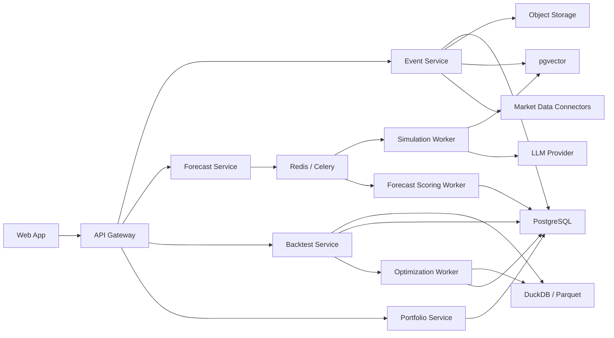

# Architecture

## Design goals

- Preserve evidence and calibration, not just narrative output.
- Keep the first version centered on paper trading and research support.
- Make every forecast reproducible from stored inputs and model versions.
- Separate event ingestion, reaction simulation, and forecast scoring.

## Recommended tech stack

| Layer | Choice | Why |
|---|---|---|
| Frontend | Next.js + TypeScript + Tailwind CSS + TanStack Query + ECharts | Good fit for research dashboards and time-series visualization |
| API | FastAPI + Pydantic + SQLAlchemy | Typed APIs and strong Python ecosystem fit |
| Async jobs | Celery + Redis | Handles ingestion, backtests, and forecast generation |
| Operational store | PostgreSQL | Persists users, forecasts, watchlists, backtest runs, and audit history |
| Vector retrieval | pgvector | Keeps document retrieval and analog lookup simple |
| Analytical store | DuckDB + Parquet | Cheap and effective for historical event replays |
| Object storage | S3 or MinIO | Stores source documents and exported reports |
| Simulation engine | Python worker with MiroFish-inspired stakeholder world modeling | Models second-order reactions, not just sentiment labels |
| Forecast engine | Gradient boosting or lightweight neural scorer + prompt-based simulation summaries | Gives both numeric and narrative outputs |
| Optimization loop | Offline worker inspired by autoresearch | Continuously improves scoring logic on fixed benchmarks |
| Market data adapters | Pluggable connectors for filings, news, transcripts, and price data vendors | Avoids coupling the product to one data provider |
| Deployment | Vercel for web, Fly.io or Render for API, Docker workers | Practical for MVP velocity |

## High-level architecture

## Primary services

### Event Service

- Ingests raw events from manual entry or connectors.
- Normalizes and deduplicates events.
- Builds a structured event package for downstream scoring.

### Forecast Service

- Creates simulation jobs from each event package.
- Combines:
  - simulation outputs,
  - historical analog retrieval,
  - price/volume context,
  - model-generated confidence.

### Backtest Service

- Replays events over historical windows.
- Computes forecast accuracy, calibration, regime sensitivity, and benchmark comparisons.

### Portfolio Service

- Converts forecasts into paper positions under configurable risk rules.
- Tracks PnL, hit rate, drawdown, and exposure.

### Optimization Worker

- Uses a fixed benchmark set of historical events.
- Tunes forecast prompts and lightweight scoring code in an autoresearch-style loop.
- Keeps only improvements that raise benchmark quality.

## Suggested data model

### Core entities

- `workspace`
- `watchlist`
- `security`
- `event`
- `event_document`
- `forecast_run`
- `forecast_horizon`
- `paper_position`
- `backtest_run`
- `calibration_snapshot`

### Example schema notes

- `event`
  - id
  - security_id
  - event_type
  - headline
  - occurred_at
  - source
  - thesis_json

- `forecast_run`
  - id
  - event_id
  - direction
  - confidence_score
  - uncertainty_notes
  - created_at

- `forecast_horizon`
  - id
  - forecast_run_id
  - horizon_days
  - expected_return_low
  - expected_return_mid
  - expected_return_high

## API shape

### Primary endpoints

- `POST /v1/events/analyze`
- `GET /v1/forecasts/{forecast_id}`
- `GET /v1/backtests/summary`
- `POST /v1/paper-positions`
- `GET /v1/watchlists/{watchlist_id}`

## Confidence and risk controls

- Every forecast must show:
  - probability,
  - calibration band,
  - evidence links,
  - time horizon,
  - model version.
- Do not show a single scalar "certainty" without uncertainty notes.
- Keep live-trading execution out of the MVP.

## MVP architecture decisions

- Start with one or two sectors, not the whole market.
- Optimize for explainability over model complexity.
- Use offline improvement loops before enabling any operational automation.
- Treat premium market data as a later upgrade, not a blocker to early validation.

